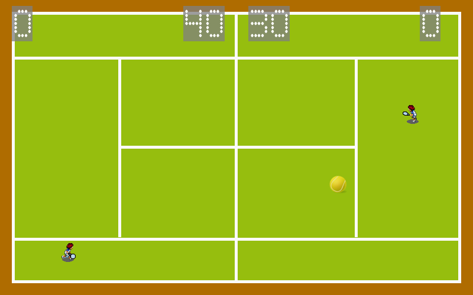

#Crafty Tennis

This is an experiment in creating an HTML5 game using the Component-Entity-System paradigm.

Built using the https://github.com/craftyjs/Crafty library it's based on the pong demo. The IDE used was the excellent https://github.com/scripted-editor/scripted !

##Added Functionality
* Animated Sprites instead of static blocks of colour
* Tennis court and ball
* AI - Play against the computer
* Sound effects
* Music
* Resizable to your browser

I also added some game logic to make it more fun:
* More realistic deflection of the ball
* Increased ball speed as the rally continues

##Player Instructions
* Player 1 (right) uses the arrow keys to move
* Player 2 (left) is the computer by default. Use ASWD to take over control.
* Press <space> to serve and start the game